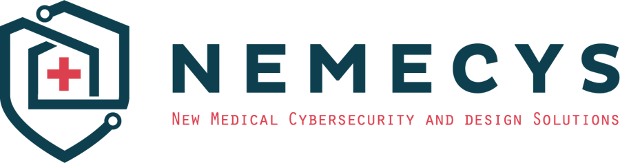
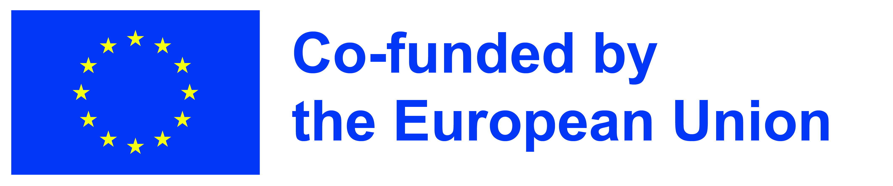

{ align=right width=300 }

# Welcome to the Cyber Compass

The Cyber Compass is a tool to help manufacturers and operators identify
relevant standards, regulations and guidelines on cybersecurity for
connected medical devices. Use the sidebar menu to navigate the tool, or
the search bar to search for specific topics. You can always click on
the house to navigate back to this page.

## Contents

* [About](content/about.md)
* [Manufacturers](content/manufacturers/manufacturer.md)
* [Operators](content/operators/operator.md)

{width="300px"}

The NEMECYS project is co-funded by the European Union, by UK Research
and Innovation (UKRI) and by the Swiss State Secretariat for Education,
Research and Innovation (SERI).
